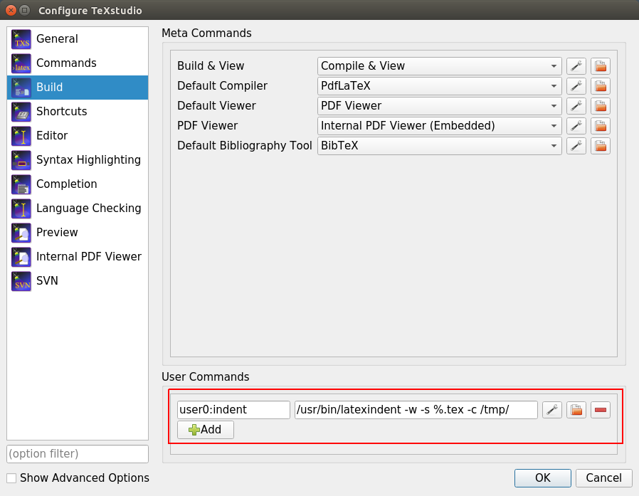
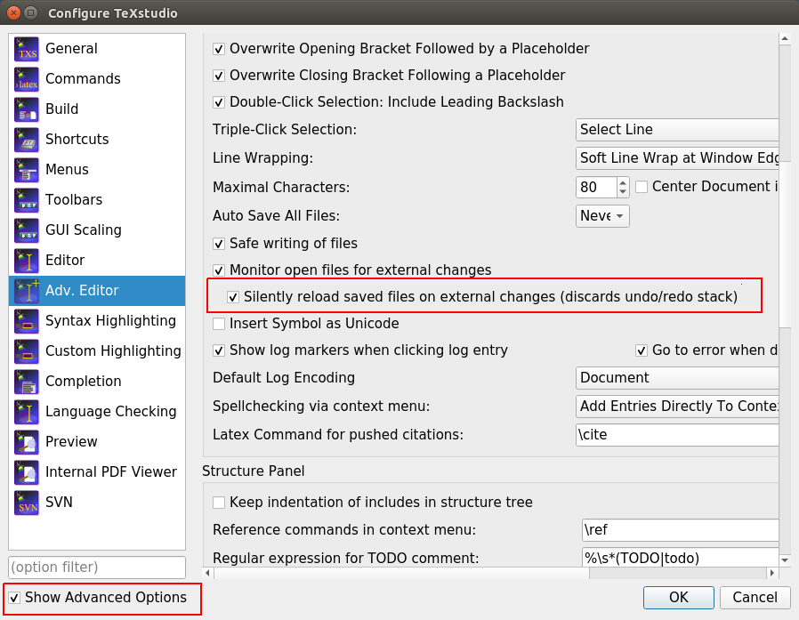

# Latext Formatter for Texstudio

## latexindent

To format Latex files one can use `latexindent` which is a perl script. Here is an example:

```
/usr/bin/latexindent -w -c /tmp/ -s latex.tex
```

| Parameter | Meaning     | 
| :-------- | :----------: | 
|  -w       | The flag says, that the file is processed in place. A backup file is created. | 
|  -s       | The silient option, which means nothing is written to the terminal. | 
|  -c <dir> | A directory for the backup and the logfile. Use a directory which is cleaned up regularly. | 

For more option call:

```
/usr/bin/latexindent -h
```

On Ubuntu `latexindent` is part of the `texlive-extra-utils` package.

## Texstudio

To call `latexindent` from Texstudio, we need to create a build command, as shown in this picture.



To start the program go to `Tools -> User -> <name>`.

If you run the program from Texstudio, then an external program modifies the opened file. In this case Texstudio
may complain about it. To tell Texstudio to simply reload the file, you have to make the following configurations:


